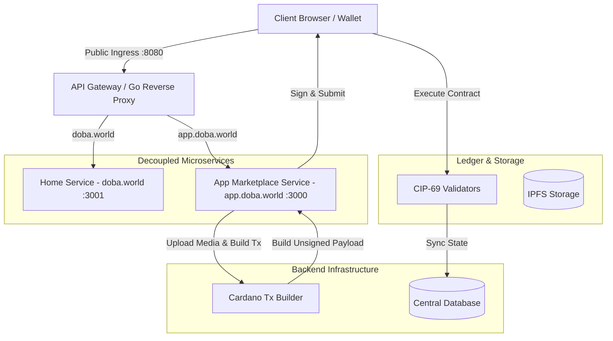

# Architecture

Doba utilizes Cardano as the settlement layer and IPFS for decentralized storage of metadata and media files.

The protocol architecture is decoupled into an **API Gateway (Reverse Proxy)** and distinct microservices:

## Off-Chain Microservices & Gateway

* **API Gateway / Reverse Proxy (Go):** The primary ingress listener at port `:8080`. Routes incoming HTTP requests based on host headers:
  - `doba.world` ➔ Reverse proxy to **Home Service** (`HOME_SERVICE_URL`, default `:3001`).
  - `app.doba.world` ➔ Reverse proxy to **App Microservice** (`APP_SERVICE_URL`, default `:3000`).
* **Home Microservice (`frontend/home`):** Handles static, landing page, and marketing interactions (`doba.world`).
* **App Microservice (`frontend/app`):** Next.js powered application handling the Cardano Web3 marketplace, studio portal, and streaming (`app.doba.world`).
* **Transaction Construction Pipeline:** A service that securely builds Cardano transactions based on backend states, passing raw unsigned transaction hex payloads back to the client.
* **Data Indexer:** Indexes the Cardano blockchain to provide an analytics layer.

## On-Chain Programs

* **Unified Multi-Purpose Validators (CIP-69 Standard):** Handles core minting and spending logic on-chain. Validators are built using Aiken for Plutus smart contracts on Cardano.

