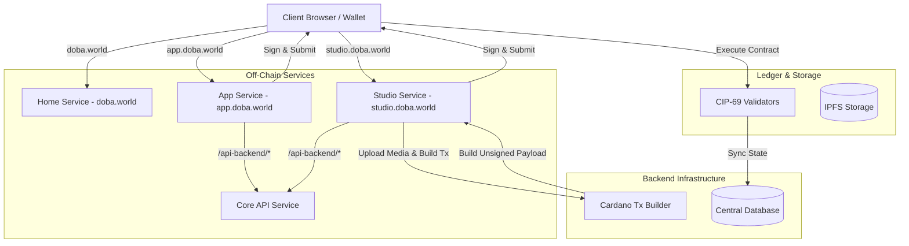

# Architecture

Doba utilizes Cardano as the settlement layer and IPFS for decentralized storage of metadata and media files.

The protocol architecture is decoupled into distinct off-chain services:

## Off-Chain Services

* **Marketing Site (`frontend/home`):** Vite + React SPA handling static, landing page, and marketing interactions (`doba.world`).
* **App (`frontend/app`):** Next.js application handling the Cardano Web3 marketplace, wallet, and streaming for fans (`app.doba.world`).
* **Studio (`frontend/studio`):** Standalone Next.js application for artists to upload, manage drafts, view analytics, and track earnings (`studio.doba.world`).
* **Core API (`frontend/app/backend/core-api`):** Bun API service backing both apps. Each Next.js app rewrites `/api-backend/*` to this service via `NEXT_PUBLIC_API_URL`.
* **Transaction Construction Pipeline:** A service that securely builds Cardano transactions based on backend states, passing raw unsigned transaction hex payloads back to the client.
* **Data Indexer:** Indexes the Cardano blockchain to provide an analytics layer.

## On-Chain Programs

* **Unified Multi-Purpose Validators (CIP-69 Standard):** Handles core minting and spending logic on-chain. Validators are built using Aiken for Plutus smart contracts on Cardano.

```mermaid
graph TD
    %% Clients
    Client[Client Browser / Wallet] -->|doba.world| Home
    Client -->|app.doba.world| App
    Client -->|studio.doba.world| Studio

    %% Services Layer
    subgraph Services [Off-Chain Services]
        Home[Home Service - doba.world]
        App[App Service - app.doba.world]
        Studio[Studio Service - studio.doba.world]
        API[Core API Service]
    end

    %% Backend & On-Chain Integrations
    subgraph Backend [Backend Infrastructure]
        TxPipe[Cardano Tx Builder]
        DB[(Central Database)]
    end

    subgraph Blockchain [Ledger & Storage]
        C69Val[CIP-69 Validators]
        Storage[(IPFS Storage)]
    end

    App -->|/api-backend/*| API
    Studio -->|/api-backend/*| API
    Studio -->|Upload Media & Build Tx| TxPipe
    TxPipe -->|Build Unsigned Payload| Studio
    App -->|Sign & Submit| Client
    Studio -->|Sign & Submit| Client
    Client -->|Execute Contract| C69Val
    C69Val -->|Sync State| DB
```
