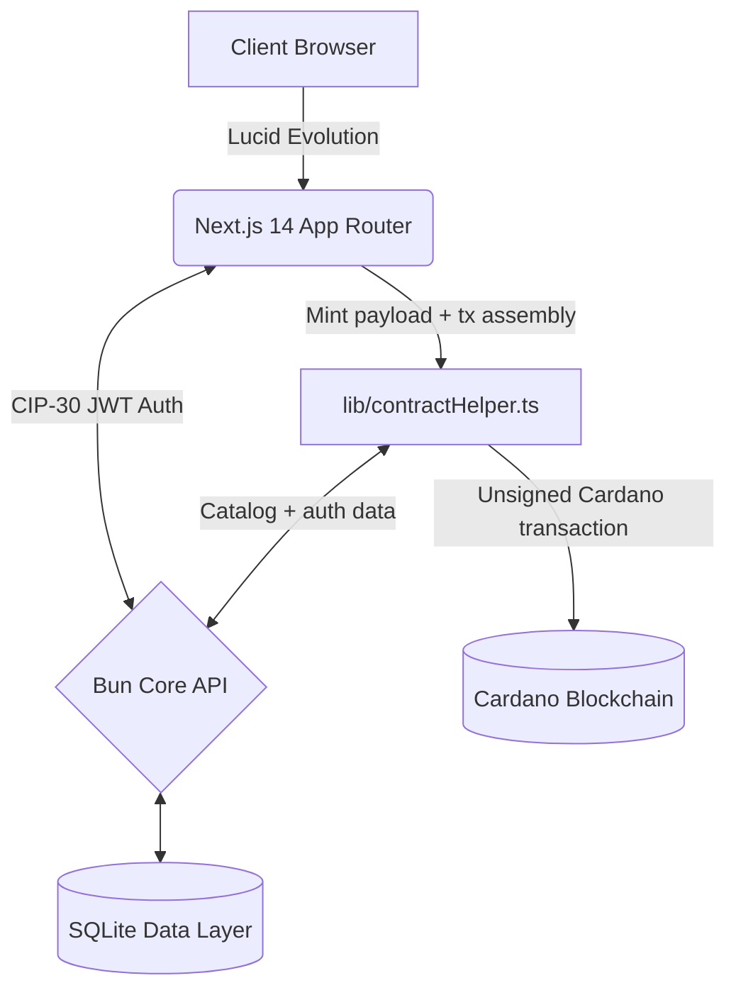

# Doba World

<div align="center">
  
  
  
  
</div>

<br />

**Doba** is a high-fidelity music streaming platform.

---

## System Architecture

Doba implements a decoupled, high-performance monorepo architecture.



### 1. Frontend Client (`/`)

The user-facing application.

- **Framework:** Next.js 14 (App Router)
- **Interface:** Tailwind CSS + custom Shadcn UI modifications
- **Web3 Engine:** Lucid Evolution for CIP-30 wallet interactions
- **Localization:** `next-intl` for multi-language support

### 2. Core API (`/backend/core-api`)

A fast, lightweight data ingestion and session management layer.

- **Runtime:** Bun
- **Database:** SQLite (`doba.db`)
- **Role:** Manages off-chain metadata, persistent user profiles, stream analytics, and cryptographic JWT issuance via native signature validation.
- **Minting support:** Provides the catalog and auth data used by the frontend mint flow; the actual Cardano transaction assembly happens in the client-side Lucid helper in `lib/contractHelper.ts`.

---

## Cryptographic Authentication (CIP-30)

Doba operates without traditional passwords through public-key cryptography for session authorization:

1. **Wallet Handshake:** Client connects via a CIP-30 compatible extension (Nami, Eternl, Vespr).
2. **Challenge Generation:** A unique, time-stamped nonce is generated.
3. **Signature:** The user signs the payload securely within their local wallet sandbox.
4. **Verification & Issuance:** The `core-api` verifies the signature against the public address, issuing secure, short-lived `accessTokens` and rotating `refreshTokens`.

---

## Asset Minting Lifecycle

The minting pipeline is designed to eliminate front-end calculation errors and prevent UTXO contention:

1. **Initiation:** The client prepares the mint payload in `lib/contractHelper.ts` and reads the release data needed for the transaction.
2. **State Validation:** The frontend validates track count, album structure, pricing inputs, and wallet state, then computes the album total as $n \times$ the individual mint price before building the transaction.
3. **Construction:** The Lucid helper selects the relevant UTXOs, calculates fees, and builds the unsigned Cardano transaction with the correct per-track or per-album payment amount.
4. **Execution:** The client prompts the user for a final signature and submits the transaction directly to the Cardano network.

---

## UI/UX Engineering

The visual language of Doba is a dark-first, editorial interface with sharp geometry and neon accents:

- **Geometry:** Flat surfaces with zero-radius composition, using squared cards, controls, and dividers.
- **Palette:** High-contrast monochrome foundations with *Midnight Black* backgrounds, *Cyber Pink* primary actions, and *Lavender* accents.
- **Typography:** *Chivo* for UI text and headings, paired with *Space Mono* and *IBM Plex Mono* for technical and numeric surfaces.
- **Motion:** Lightweight micro-interactions such as subtle pulses, hover scaling, and segmented layout transitions.

---

## Deployment & Local Development

### Prerequisites

- [Node.js](https://nodejs.org/) & [Bun](https://bun.sh/)
- A CIP-30 compatible Cardano Wallet

### Initialization

1. **Environment Configuration:**
   Copy the template and provide your Blockfrost API keys.

   ```bash
   cp .env.example .env
   ```

2. **Dependency Resolution:**

   ```bash
   # Frontend & Bun core API
   bun install
   ```

3. **Launch Stack:**
   A single command orchestrates the frontend and Bun core API.

   ```bash
   bun run dev:all
   ```

   *The client will be accessible at `http://localhost:3000`.*

---

## 📄 License & Intellectual Property

Copyright © 2026 Doba Protocol.
