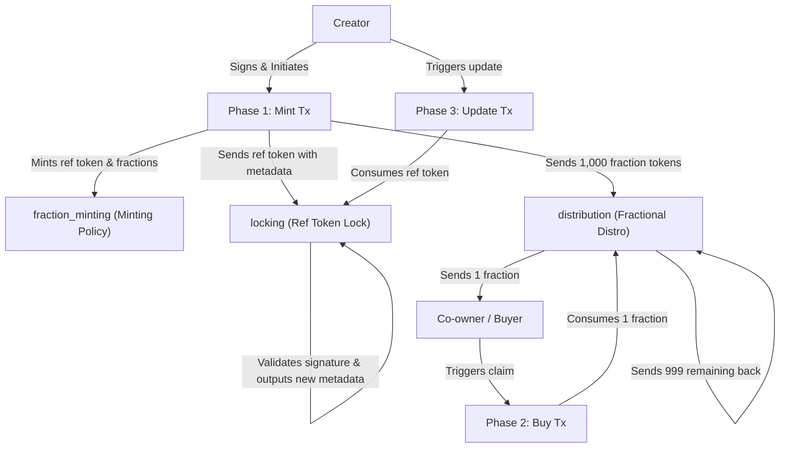

# Doba Protocol: Smart Contract Architecture

This document provides a detailed explanation of the smart contracts that power the fractionalization of music tracks (music NFTs) on the Doba Protocol.

The contracts are written in **Aiken** (located in `contracts/validators/frac.ak`) and compile to the Plutus V3 blueprint (`contracts/plutus.json`). The client-side interactions are implemented in TypeScript using **Lucid Evolution** (`contracts/validators/frac.ts` and `contracts/validators/buy.ts`).

---

## 1. High-Level Architecture Overview

Doba Protocol uses a multi-script architecture to manage fractionalized assets. It follows the **CIP-68 (Datum Metadata Standard)** pattern, which separates the asset's representation (the user-facing token) from its metadata (the reference token holding the data).



---

## 2. CIP-68 Token Standard Mapping

CIP-68 defines standard prefixes (labels) to attach to token names under the same minting policy ID (`PolicyId`). Doba uses:
1. **Reference Token (Label `100` / Hex `000643b0`)**:
   - Quantity: **Exactly 1** is minted.
   - Location: Locked in the `locking` contract.
   - Purpose: Stores the NFT metadata in its inline datum (`TokenDatum`).
2. **Fractional Tokens (Label `444` / Hex `001bc280`)**:
   - Quantity: **`N`** (e.g., 1000 fractions) are minted.
   - Location: Locked in the `distribution` contract.
   - Purpose: Distributed to co-owners (buyers) or royalty stakeholders.

---

## 3. CIP-60 Version 3 Music Metadata Standard

Under CIP-60 v3 (complying with CIP-68), the reference token's inline datum must follow a strictly structured nested map:

```
TokenDatum (Constructor 0)
└── Fields
    ├── Map (Metadata)
    │   ├── "name" -> "My Fractional NFT" (release/token name)
    │   ├── "image" -> "ipfs://your-image-cid-here" (thumbnail/artwork)
    │   ├── "music_metadata_version" -> 3 (integer)
    │   ├── "royalty_rate" -> "0.05" (string, e.g. 5% royalty percentage)
    │   ├── "royalty_address" -> "addr1..." (string, royalty payout address)
    │   ├── "release" -> Map
    │   │   ├── "release_title" -> "The Fractional Album"
    │   │   └── "release_type" -> "Single" | "Album/EP" | "Multiple"
    │   └── "files" -> Array
    │       └── [0] -> Map (File Object)
    │           ├── "name" -> "My Fractional Track Audio"
    │           ├── "mediaType" -> "audio/mpeg"
    │           ├── "src" -> "ipfs://your-audio-file-cid-here"
    │           └── "song" -> Map (Song Object)
    │               ├── "song_title" -> "My Fractional Track"
    │               ├── "song_duration" -> "PT3M45S" (ISO-8601 duration)
    │               ├── "track_number" -> 1 (integer)
    │               └── "artists" -> Array
    │                   └── [0] -> Map (Artist Object)
    │                       └── "name" -> "Artist Name"
    └── 1 (Datum version number)
```

---

## 4. Validator Breakdown

The smart contract suite consists of three validators defined in `frac.ak`:

### A. `fraction_minting` (Minting Policy)
Controls the minting and burning of both the reference token and the fractional tokens.

* **Parameters:**
  * `owner: VerificationKeyHash` — The public key hash of the creator who has exclusive permission to mint (represented by the `owner` parameter in Aiken).
* **Redeemer (`MintAction`):**
  ```rust
  pub type MintAction {
    action: Int,       // 1 = Mint, any other = Burn
    amount: Int,       // The number of fractional tokens to mint/burn
    token_name: ByteArray, // The base token name (e.g. "FTOIC01")
  }
  ```
* **Validation Logic:**
  * **Minting (`r.action == 1`)**:
    * Verifies that the transaction is signed by the creator (`owner`).
    * Expects exactly two assets to be minted under the policy ID: one reference token (qty = 1) and one fractional token (qty = `r.amount`).
    * Verifies that the token names are correctly formed (the reference token prefix matches `100` and the fractional token prefix matches `444` using `ok.fraction_token_prefix`).
    * Verifies that the reference token is sent to an output containing an inline datum matching `TokenDatum` (metadata).
    * Verifies that the fractional tokens are sent to another output.
  * **Burning (`r.action != 1`)**:
    * Verifies that the transaction is signed by the creator (`owner`).
    * Assures that exactly `1` reference token and `r.amount` fractional tokens are burned (`ref_amount == -1 && frac_amount == -r.amount`).

---

### B. `locking` (Ref Token Locking Validator)
Locks the reference token (Label `100`) containing the metadata inline datum.

* **Parameters:**
  * `owner: VerificationKeyHash` — The creator authorized to update metadata (represented by `owner` parameter in Aiken).
  * `cs: PolicyId` — The currency symbol (Policy ID) of the minting script.
* **Redeemer (`LockAction`):**
  ```rust
  pub type LockAction {
    action: Int,    // 1 = Update metadata, any other = Unlock/Burn
    field_b: Int,
  }
  ```
* **Validation Logic:**
  * **Update (`r.action == 1`)**:
    * Verifies that the transaction is signed by the creator (`owner`).
    * Ensures the reference token remains locked at this script address by checking that the script output contains a single token of the policy `cs` (`ok.contains_single_token_of`).
    * Verifies that the continuing output's datum parses successfully as a valid inline `TokenDatum` to prevent metadata corruption.
    * Allows the creator to modify the inline datum (updating the song's IPFS CID, title, track details, etc.) without releasing the token.
  * **Unlock/Burn (`r.action != 1`)**:
    * Verifies that the transaction is signed by the creator (`owner`).
    * Allows the creator to spend/withdraw the reference token (usually to burn it in the same transaction).

---

### C. `distribution` (Fractional Token Distribution Validator)
Holds and manages the fractional tokens (Label `444`) to be distributed to co-owners (buyers).

* **Parameters:**
  * `owner: VerificationKeyHash` — The creator (who is paid from buys, can update price, and can reclaim remaining fractions).
  * `treasury: Address` — The platform treasury address that receives the fee on every buy transaction.
  * `fee_bps: Int` — The platform fee percentage in basis points (e.g. 100 = 1%).
* **Datum (`DisDatum`):**
  ```rust
  pub type DisDatum {
    price_lovelace: Int,
  }
  ```
* **Redeemer (`DisAction`):**
  ```rust
  pub type DisAction {
    action: Int,    // 1 = Buy, 2 = UpdatePrice, any other = Reclaim
    field_b: Int,
  }
  ```
* **Validation Logic:**
  * **Buy (`r.action == 1`)**:
    * Does **not** require the creator's signature, allowing any buyer/co-owner to execute the transaction.
    * **Double-Satisfaction Prevention**: Verifies that only exactly one input from the distribution script is spent in the transaction (disallows batch spending).
    * **Fraction Accounting & Conditional Script Closing**:
      * **If there are remaining fractions**: Enforces that exactly one continuing output is sent back to the script containing exactly one less fractional token, and that the datum and Lovelace value of the UTXO are fully preserved.
      * **If this is the final fraction purchase**: Allows the transaction to close the script cleanly without requiring a continuing output, preventing the buyer's min-ADA from being permanently locked.
    * **Treasury fee payment**: Verifies that the platform treasury address receives at least `price_lovelace * fee_bps / 10000` lovelace.
    * **Creator payment**: Verifies that the creator's payment credential receives at least `price_lovelace - fee` lovelace.
  * **UpdatePrice (`r.action == 2`)**:
    * Requires the transaction to be signed by the creator (`owner`).
    * Ensures the fractional tokens do not leave the contract (`tokens_preserved`).
    * Checks that the new price stored in the continuing output's inline datum is positive (`> 0`).
  * **Reclaim (`r.action != 1 && r.action != 2`)**:
    * Requires the transaction to be signed by the creator (`owner`).
    * Allows the creator to withdraw the remaining fractional tokens from the distribution pool.

---

## 5. Step-by-Step Transaction Flow (TypeScript)

The orchestration script (`frac.ts` and `buy.ts`) interacts with the contracts in three distinct phases:

### Phase 1: Minting (`mintTokens` in `frac.ts`)
Initializes the track. It mints the tokens and routes them to their respective script addresses.

```typescript
const artist = new Map<Data, Data>();
artist.set(fromText("name"), fromText("Artist Name"));

const songData = new Map<Data, Data>();
songData.set(fromText("song_title"), fromText("My Fractional Track"));
songData.set(fromText("song_duration"), fromText("PT3M45S")); // Required ISO-8601 duration
songData.set(fromText("track_number"), BigInt(1));
songData.set(fromText("artists"), [artist]); // Array of Artist maps

const fileData = new Map<Data, Data>();
fileData.set(fromText("name"), fromText("My Fractional Track Audio"));
fileData.set(fromText("mediaType"), fromText("audio/mpeg"));
fileData.set(fromText("src"), fromText("ipfs://your-audio-file-cid-here"));
fileData.set(fromText("song"), songData);

const releaseData = new Map<Data, Data>();
releaseData.set(fromText("release_title"), fromText("The Fractional Album"));
releaseData.set(fromText("release_type"), fromText("Single"));

const metadata = new Map<Data, Data>();
metadata.set(fromText("name"), fromText("My Fractional NFT"));
metadata.set(fromText("description"), fromText("A fractionalized masterpiece."));
metadata.set(fromText("image"), fromText("ipfs://your-image-cid-here"));
metadata.set(fromText("music_metadata_version"), BigInt(3)); // CIP-60 Version 3
metadata.set(fromText("release"), releaseData);
metadata.set(fromText("files"), [fileData]);

const lDatum = Data.to(new Constr(0, [metadata, BigInt(1)]));
const dDatum = Data.to(new Constr(0, [PRICE_LOVELACE])); // e.g. 5_000_000n
```

The minting transaction registers the datum and pays out:
```typescript
const tx = await lucid
  .newTx()
  .mintAssets({
    [toUnit(mintCS, tokenName, 100)]: BigInt(1),    // Reference Token
    [toUnit(mintCS, tokenName, 444)]: BigInt(1000)  // 1000 Fractions
  }, mintRedeemer)
  .attach.MintingPolicy(mint)
  .pay.ToContract(lAddress, { kind: "inline", value: lDatum }, { [toUnit(mintCS, tokenName, 100)]: BigInt(1) })
  .pay.ToContract(dAddress, { kind: "inline", value: dDatum }, { [toUnit(mintCS, tokenName, 444)]: BigInt(1000) })
  .addSignerKey(ownerPKH)
  .complete();
```

### Phase 2: Claiming/Buying Fractions (`buy.ts`)
Allows a co-owner to claim a fraction from the distribution pool by supplying payments to the creator and the treasury.

```typescript
const fee = PRICE_LOVELACE * FEE_BPS / 10000n;
const creatorPayment = PRICE_LOVELACE - fee;

let tx = lucid
  .newTx()
  .collectFrom([utxo], redeemer)
  .attach.SpendingValidator(distro)
  .pay.ToAddress(beneficiaryAddress, { [unit]: 1n })
  .pay.ToAddress(creatorAddress, { lovelace: creatorPayment })
  .pay.ToAddress(treasuryAddress, { lovelace: fee }); // If configured

// Pay remaining fractions back to the contract if any
if (outValue > 0n) {
  tx = tx.pay.ToContract(dAddress, { kind: "inline", value: dDatum }, { [unit]: outValue });
}

const completedTx = await tx.complete();
```

### Phase 3: Updating Metadata (`updateTokens` in `frac.ts`)
Allows the creator to modify the track metadata (e.g., fixing typos in the song details or changing the IPFS image URL).

```typescript
const tx = await lucid
  .newTx()
  .collectFrom([utxo], redeemer)
  .attach.SpendingValidator(lock)
  .pay.ToContract(lAddress, { kind: "inline", value: lDatum2 }, { [unit]: BigInt(1) })
  .addSignerKey(ownerPKH)
  .complete();
```

---

## 6. Audit

During audits, several vulnerabilities and logical mismatches were identified and resolved:

### A. Double-Satisfaction (Value Sharing) Prevention
* **Vulnerability:** Batching multiple distribution spends in a single transaction could allow a single creator/treasury payment to satisfy multiple script invocations (buying multiple fractions for the price of one).
* **Resolution:** The `distribution` validator checks that exactly one input is spent from the distribution script per transaction, preventing batch claims.

### B. Min-ADA Locked on Final Purchase Resolved
* **Vulnerability:** The validator previously required a continuing output to the script in all buy cases. The final buyer had to lock ~1.5 to 2 ADA in an empty script output.
* **Resolution:** The validator now performs a conditional check. If the input UTXO contains exactly 1 fractional token, no continuing output is required, allowing the script to close cleanly.

### C. Lovelace / ADA Conservation Enforced
* **Vulnerability:** Buyers could drain any excess ADA accidentally locked in the distribution UTXO since only the fractional tokens were conserved.
* **Resolution:** When a continuing output is created, the validator verifies that its Lovelace value is greater than or equal to the input's Lovelace value.

### D. Datum Validation in Metadata Update Enforced
* **Vulnerability:** A creator error during a track update could write an empty or corrupt datum, breaking CIP-68/CIP-60 compliance.
* **Resolution:** The `locking` validator now verifies that the continuing output has a valid inline datum matching the `TokenDatum` type structure.

### E. Parameter Application in Deployment Scripts Corrected
* **Vulnerability:** `frac.ts` applied only one parameter instead of three, causing a runtime parameter application mismatch during the distro phase.
* **Resolution:** Both `frac.ts` and `buy.ts` now implement an `encodeAddress` helper to correctly encode the `treasury` Plutus Address parameter, matching the three-parameter schema: `[owner, treasury, fee_bps]`.

---

## 7. Frontend Explorer & Provenance Mappings

To enable trustless provenance verification, the user interface integrates explorer lookups for the on-chain smart contract artifacts:

1. **Token Policy Link:**
   - Redirects to Cardanoscan's Token Policy endpoint: `${EXPLORER_URL}/tokenPolicy/${policyId}`
   - Resolves the minting rules and total supply of the fractional tokens.

2. **Provenance (Reference NFT) Link:**
   - Maps to Cardanoscan's Asset endpoint: `${EXPLORER_URL}/token/${assetUnit}`
   - The `assetUnit` is calculated by concatenating:
     - The `PolicyId` (e.g. `e51e9938...`)
     - The CIP-68 Reference Label `000643b0` (representing label `100` for metadata)
     - The hex-encoded uppercase `Asset Ticker` (e.g. `LIDO` -> `4c49444f`)
   - This link displays the locked metadata datum on-chain, proving the authenticity and metadata history of the track.

3. **Creator Address Link:**
   - Redirects to Cardanoscan's address or stake address endpoint: `${EXPLORER_URL}/address/${uploader_address}`
   - Allows users to verify the creator's identity on-chain.


