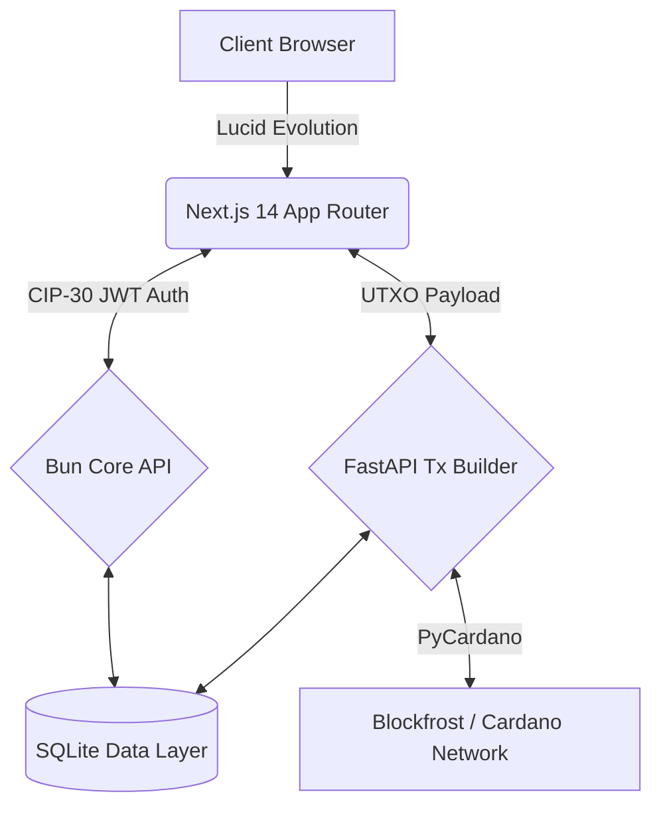

# Doba Protocol

<div align="center">
  
  
  
  
  
</div>

<br />

**Doba** is a high-fidelity music streaming platform built natively on the **Cardano** blockchain.

---

## System Architecture

Doba implements a decoupled, high-performance monorepo architecture.



### 1. Frontend Client (`/`)
The user-facing application.
- **Framework:** Next.js 14 (App Router)
- **Interface:** Tailwind CSS + custom Shadcn UI modifications
- **Web3 Engine:** Lucid Evolution for CIP-30 wallet interactions
- **Localization:** `next-intl` for multi-language support

### 2. Core API (`/backend/core-api`)
A fast, lightweight data ingestion and session management layer.
- **Runtime:** Bun
- **Database:** SQLite (`doba.db`)
- **Role:** Manages off-chain metadata, persistent user profiles, stream analytics, and cryptographic JWT issuance via native signature validation.

### 3. Transaction Microservice (`/backend/tx-builder`)
A transaction construction engine.
- **Runtime:** Python 3.9+ / FastAPI
- **SDK:** PyCardano
- **Role:** Receives raw UTXOs, queries the database for accurate royalty distribution splits, and deterministically constructs balanced, unsigned CBOR transactions for client-side signing.

---

## Cryptographic Authentication (CIP-30)

Doba operates without traditional passwords through public-key cryptography for session authorization:

1. **Wallet Handshake:** Client connects via a CIP-30 compatible extension (Nami, Eternl, Vespr).
2. **Challenge Generation:** A unique, time-stamped nonce is generated.
3. **Signature:** The user signs the payload securely within their local wallet sandbox.
4. **Verification & Issuance:** The `core-api` verifies the signature against the public address, issuing secure, short-lived `accessTokens` and rotating `refreshTokens`.

---

## Asset Minting Lifecycle

The minting pipeline is designed to eliminate front-end calculation errors and prevent UTXO contention:

1. **Initiation:** The client queries local UTXOs via Lucid and transmits them to the Python `tx-builder`.
2. **State Validation:** The microservice verifies on-chain asset pricing and multi-party collaborator splits from the secure database.
3. **Construction:** `PyCardano` selects the optimal UTXOs, calculates exact network fees, and allocates Lovelace across all split recipients.
4. **Execution:** The backend returns an unsigned CBOR hex. The client prompts the user for a final signature and submits the transaction directly to the Cardano network.

---

## UI/UX Engineering

The visual language of Doba adheres to a brutalist aesthetic designed for modern media consumption:
- **Geometry:** 0px `border-radius` enforced globally across all DOM elements.
- **Palette:** High-contrast Dark Mode featuring *Midnight Black*, *Cyber Pink*, *Lavender*, and *Neon Green* active states.
- **Typography:** *Neue Machina* (Display/Headers) paired with *IBM Plex Mono* (Technical/Data).
- **Motion:** Purposeful micro-interactions including kinetic backdrop blurs, subtle scaling pulses, and segmented layout dividers.

---

## Deployment & Local Development

### Prerequisites
- [Node.js](https://nodejs.org/) & [Bun](https://bun.sh/)
- [Python 3.9+](https://www.python.org/)
- A CIP-30 compatible Cardano Wallet

### Initialization

1. **Environment Configuration:**
   Copy the template and provide your Blockfrost API keys.
   ```bash
   cp .env.example .env
   ```

2. **Dependency Resolution:**
   ```bash
   # Frontend & Bun API
   bun install
   ```

3. **Launch Stack:**
   A single command orchestrates the entire monorepo (Next.js client, Bun API, and FastAPI service).
   ```bash
   bun run dev:all
   ```
   *The client will be accessible at `http://localhost:3000`.*

---

## 📄 License & Intellectual Property

Copyright © 2026 Doba Protocol.
